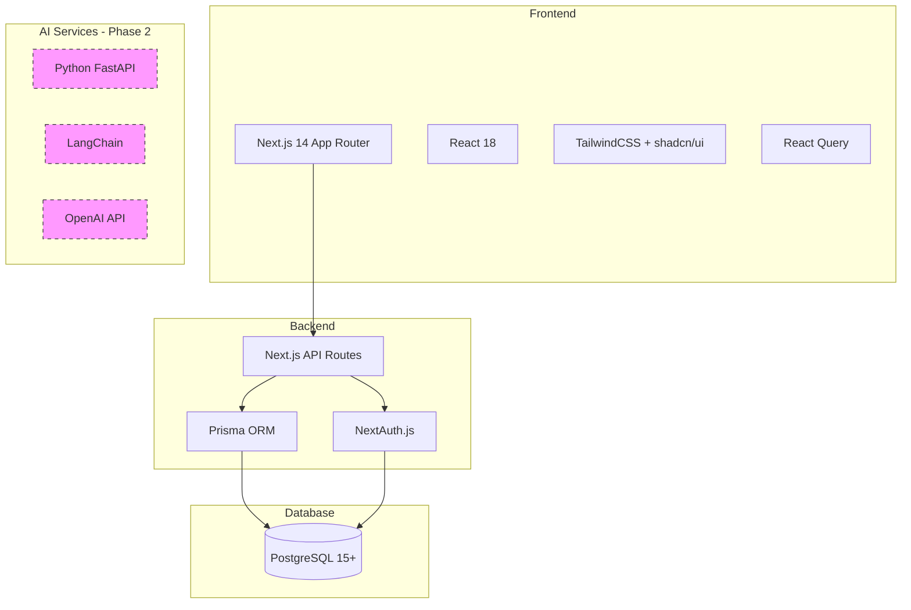
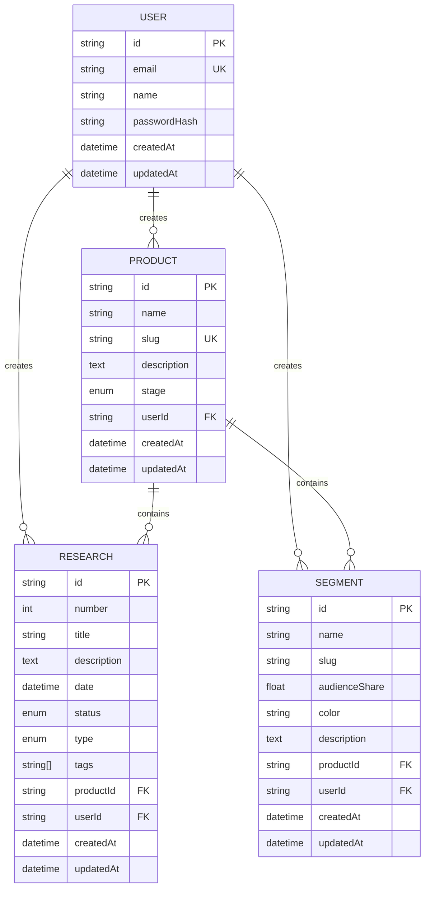

# План разработки MVP платформы ECHO

**Версия:** 1.0  
**Дата:** 3 августа 2026  
**Режим разработки:** Solo-разработчик  
**Технологический стек:** Next.js + Node.js + PostgreSQL + Python (AI)

---

## Исполнительное резюме

Этот план описывает поэтапную разработку MVP платформы ECHO для solo-разработчика. Фокус на модулях P0 с минимальным, но функциональным набором возможностей для валидации концепции и получения первых пользователей.

**Цель MVP:** Создать работающую платформу, где продакт-менеджер может хранить исследования, управлять сегментами клиентов и связывать их с профилем продукта.

**Критерий успеха MVP:** Один продакт-менеджер может полноценно использовать платформу для управления одним продуктом с базовыми функциями исследований и сегментации.

---

## 1. Архитектура MVP

### 1.1 Технологический стек



### 1.2 Упрощения для MVP

**Что ВКЛЮЧАЕМ в MVP:**
- ✅ Монолитная архитектура (Next.js fullstack)
- ✅ Один workspace (без мультитенантности)
- ✅ Базовая аутентификация (email + password)
- ✅ Одна роль пользователя (admin)
- ✅ Только русский язык интерфейса
- ✅ Локальное хранилище файлов

**Что ОТКЛАДЫВАЕМ на потом:**
- ❌ AI-функции (Chat, генерация гипотез)
- ❌ Мультиязычность (EN)
- ❌ Интеграции (Яндекс.Метрика, LangFuse)
- ❌ Внешние агенты (MCP)
- ❌ Продвинутая ролевая модель
- ❌ Экспорт в PDF/CSV

---

## 2. Модули P0 для MVP

### 2.1 Управление продуктами (P0)

**Минимальный функционал:**
- Создание одного продукта
- Поля: название, slug, описание (RU), стадия
- Редактирование профиля продукта
- Просмотр профиля продукта

**Технические детали:**
- Модель `Product` в Prisma
- CRUD API endpoints
- Форма создания/редактирования
- Страница просмотра профиля

### 2.2 Исследования (P0)

**Минимальный функционал:**
- Создание исследования вручную
- Поля: номер (автогенерация), название, дата, статус, тип, описание
- Список исследований (табличный вид)
- Просмотр карточки исследования
- Редактирование и удаление

**Технические детали:**
- Модель `Research` в Prisma
- CRUD API endpoints
- Список с фильтрацией по статусу
- Детальная страница исследования

### 2.3 Сегменты клиентов (P0)

**Минимальный функционал:**
- Создание сегмента
- Поля: название, slug, доля аудитории (%), цветовая метка, описание
- Список сегментов
- Просмотр и редактирование сегмента
- Привязка сегмента к продукту

**Технические детали:**
- Модель `Segment` в Prisma
- CRUD API endpoints
- Карточный вид сегментов
- Цветовые метки (предустановленные)

---

## 3. Структура базы данных

### 3.1 Схема Prisma (упрощенная для MVP)

```prisma
// Пользователи
model User {
  id            String    @id @default(cuid())
  email         String    @unique
  name          String?
  passwordHash  String
  createdAt     DateTime  @default(now())
  updatedAt     DateTime  @updatedAt
  
  products      Product[]
  researches    Research[]
  segments      Segment[]
}

// Продукты
model Product {
  id          String   @id @default(cuid())
  name        String
  slug        String   @unique
  description String?  @db.Text
  stage       Stage    @default(IDEA)
  createdAt   DateTime @default(now())
  updatedAt   DateTime @updatedAt
  
  userId      String
  user        User     @relation(fields: [userId], references: [id], onDelete: Cascade)
  
  researches  Research[]
  segments    Segment[]
}

enum Stage {
  IDEA
  MVP
  GROWTH
  SCALE
}

// Исследования
model Research {
  id          String         @id @default(cuid())
  number      Int            @default(autoincrement())
  title       String
  description String?        @db.Text
  date        DateTime       @default(now())
  status      ResearchStatus @default(IN_PROGRESS)
  type        ResearchType
  tags        String[]
  createdAt   DateTime       @default(now())
  updatedAt   DateTime       @updatedAt
  
  productId   String
  product     Product        @relation(fields: [productId], references: [id], onDelete: Cascade)
  
  userId      String
  user        User           @relation(fields: [userId], references: [id], onDelete: Cascade)
}

enum ResearchStatus {
  IN_PROGRESS
  COMPLETED
}

enum ResearchType {
  QUALITATIVE
  SURVEY
  ANALYTICS
  DESK_RESEARCH
  MANUAL
  QUANTITATIVE
  USABILITY_TESTING
}

// Сегменты
model Segment {
  id              String   @id @default(cuid())
  name            String
  slug            String
  audienceShare   Float?   // процент от 0 до 100
  color           String   @default("#3B82F6")
  description     String?  @db.Text
  createdAt       DateTime @default(now())
  updatedAt       DateTime @updatedAt
  
  productId       String
  product         Product  @relation(fields: [productId], references: [id], onDelete: Cascade)
  
  userId          String
  user            User     @relation(fields: [userId], references: [id], onDelete: Cascade)
  
  @@unique([productId, slug])
}
```

### 3.2 ER-диаграмма MVP



---

## 4. Поэтапный план разработки

### Фаза 0: Подготовка инфраструктуры

**Задачи:**
- Инициализация Next.js проекта с TypeScript
- Настройка Prisma + PostgreSQL
- Настройка TailwindCSS + shadcn/ui
- Настройка NextAuth.js для аутентификации
- Настройка ESLint + Prettier
- Создание базовой структуры проекта

**Структура проекта:**
```
rpm-platform/
├── src/
│   ├── app/                    # Next.js App Router
│   │   ├── (auth)/            # Группа маршрутов для аутентификации
│   │   │   ├── login/
│   │   │   └── register/
│   │   ├── (dashboard)/       # Группа маршрутов для основного приложения
│   │   │   ├── products/
│   │   │   ├── researches/
│   │   │   └── segments/
│   │   ├── api/               # API Routes
│   │   │   ├── auth/
│   │   │   ├── products/
│   │   │   ├── researches/
│   │   │   └── segments/
│   │   └── layout.tsx
│   ├── components/            # React компоненты
│   │   ├── ui/               # shadcn/ui компоненты
│   │   ├── forms/            # Формы
│   │   ├── layouts/          # Layouts
│   │   └── shared/           # Общие компоненты
│   ├── lib/                  # Утилиты и конфигурация
│   │   ├── prisma.ts
│   │   ├── auth.ts
│   │   └── utils.ts
│   └── types/                # TypeScript типы
├── prisma/
│   ├── schema.prisma
│   └── migrations/
├── public/
├── .env.local
├── next.config.js
├── tailwind.config.ts
└── package.json
```

**Ключевые библиотеки:**
```json
{
  "dependencies": {
    "next": "^14.2.0",
    "react": "^18.3.0",
    "react-dom": "^18.3.0",
    "@prisma/client": "^5.15.0",
    "next-auth": "^4.24.0",
    "@tanstack/react-query": "^5.45.0",
    "zod": "^3.23.0",
    "react-hook-form": "^7.51.0",
    "@hookform/resolvers": "^3.6.0",
    "date-fns": "^3.6.0",
    "lucide-react": "^0.395.0"
  },
  "devDependencies": {
    "typescript": "^5.4.0",
    "prisma": "^5.15.0",
    "@types/node": "^20.14.0",
    "@types/react": "^18.3.0",
    "tailwindcss": "^3.4.0",
    "eslint": "^8.57.0",
    "prettier": "^3.3.0"
  }
}
```

---

### Фаза 1: Аутентификация и базовый UI

**Задачи:**
- Реализация регистрации пользователя
- Реализация входа/выхода
- Создание защищенных маршрутов
- Базовый layout приложения (header, sidebar, main)
- Навигационное меню

**Компоненты:**
- `LoginForm` - форма входа
- `RegisterForm` - форма регистрации
- `DashboardLayout` - основной layout
- `Sidebar` - боковое меню
- `Header` - шапка с профилем пользователя

**API endpoints:**
- `POST /api/auth/register` - регистрация
- NextAuth.js endpoints для аутентификации

---

### Фаза 2: Модуль "Продукты"

**Задачи:**
- Создание модели Product в Prisma
- API endpoints для CRUD операций
- Форма создания продукта
- Страница профиля продукта
- Форма редактирования продукта

**Компоненты:**
- `ProductForm` - форма создания/редактирования
- `ProductProfile` - страница профиля продукта
- `ProductCard` - карточка продукта
- `StageSelect` - выбор стадии продукта

**API endpoints:**
- `POST /api/products` - создание продукта
- `GET /api/products/:id` - получение продукта
- `PUT /api/products/:id` - обновление продукта
- `DELETE /api/products/:id` - удаление продукта

**Валидация (Zod):**
```typescript
const productSchema = z.object({
  name: z.string().min(1, "Название обязательно"),
  slug: z.string().min(1).regex(/^[a-z0-9-]+$/, "Только латиница, цифры и дефис"),
  description: z.string().optional(),
  stage: z.enum(["IDEA", "MVP", "GROWTH", "SCALE"])
});
```

---

### Фаза 3: Модуль "Исследования"

**Задачи:**
- Создание модели Research в Prisma
- API endpoints для CRUD операций
- Список исследований с фильтрацией
- Форма создания исследования
- Детальная страница исследования
- Редактирование и удаление

**Компоненты:**
- `ResearchList` - список исследований
- `ResearchForm` - форма создания/редактирования
- `ResearchCard` - карточка исследования
- `ResearchDetail` - детальная страница
- `ResearchFilters` - фильтры (по статусу, типу)
- `StatusBadge` - бейдж статуса

**API endpoints:**
- `GET /api/researches` - список исследований (с фильтрами)
- `POST /api/researches` - создание исследования
- `GET /api/researches/:id` - получение исследования
- `PUT /api/researches/:id` - обновление исследования
- `DELETE /api/researches/:id` - удаление исследования

**Функции:**
- Автогенерация номера исследования
- Фильтрация по статусу и типу
- Сортировка по дате
- Поиск по названию

---

### Фаза 4: Модуль "Сегменты"

**Задачи:**
- Создание модели Segment в Prisma
- API endpoints для CRUD операций
- Список сегментов (карточный вид)
- Форма создания сегмента
- Детальная страница сегмента
- Цветовые метки

**Компоненты:**
- `SegmentList` - список сегментов
- `SegmentForm` - форма создания/редактирования
- `SegmentCard` - карточка сегмента
- `SegmentDetail` - детальная страница
- `ColorPicker` - выбор цвета

**API endpoints:**
- `GET /api/segments` - список сегментов
- `POST /api/segments` - создание сегмента
- `GET /api/segments/:id` - получение сегмента
- `PUT /api/segments/:id` - обновление сегмента
- `DELETE /api/segments/:id` - удаление сегмента

**Функции:**
- Предустановленные цвета (8-10 вариантов)
- Валидация доли аудитории (0-100%)
- Уникальность slug в рамках продукта

---

### Фаза 5: Связи между модулями

**Задачи:**
- Привязка исследований к продукту
- Привязка сегментов к продукту
- Отображение связанных данных
- Фильтрация по продукту

**Компоненты:**
- `ProductSelector` - выбор продукта в формах
- `RelatedResearches` - список связанных исследований
- `RelatedSegments` - список связанных сегментов

**Функции:**
- Каскадное удаление (при удалении продукта удаляются связанные данные)
- Счетчики (количество исследований, сегментов в продукте)
- Фильтрация списков по выбранному продукту

---

### Фаза 6: Полировка и тестирование

**Задачи:**
- Обработка ошибок и валидация
- Loading states и skeleton screens
- Пустые состояния (empty states)
- Подтверждение удаления
- Toast уведомления
- Адаптивная верстка (responsive design)
- Ручное тестирование всех функций

**Компоненты:**
- `ErrorBoundary` - обработка ошибок
- `LoadingSpinner` - индикатор загрузки
- `EmptyState` - пустое состояние
- `ConfirmDialog` - диалог подтверждения
- `Toast` - уведомления

**Тестирование:**
- Создание, редактирование, удаление всех сущностей
- Валидация форм
- Обработка ошибок API
- Проверка на разных разрешениях экрана

---

## 5. Milestone и чекпоинты

### Milestone 1: Инфраструктура готова
**Критерии:**
- ✅ Проект инициализирован
- ✅ База данных подключена
- ✅ Аутентификация работает
- ✅ Базовый UI создан

### Milestone 2: Модуль "Продукты" работает
**Критерии:**
- ✅ Можно создать продукт
- ✅ Можно просмотреть профиль продукта
- ✅ Можно отредактировать продукт
- ✅ Можно удалить продукт

### Milestone 3: Модуль "Исследования" работает
**Критерии:**
- ✅ Можно создать исследование
- ✅ Список исследований отображается
- ✅ Фильтрация работает
- ✅ Детальная страница работает
- ✅ Редактирование и удаление работают

### Milestone 4: Модуль "Сегменты" работает
**Критерии:**
- ✅ Можно создать сегмент
- ✅ Список сегментов отображается
- ✅ Цветовые метки работают
- ✅ Детальная страница работает
- ✅ Редактирование и удаление работают

### Milestone 5: MVP готов к использованию
**Критерии:**
- ✅ Все модули P0 работают
- ✅ Связи между модулями работают
- ✅ Обработка ошибок реализована
- ✅ UI отполирован
- ✅ Адаптивная верстка работает
- ✅ Ручное тестирование пройдено

---

## 6. Технические решения для ускорения разработки

### 6.1 UI компоненты
**Использовать shadcn/ui** - готовые компоненты:
- Button, Input, Select, Textarea
- Dialog, Sheet, Popover
- Table, Card, Badge
- Form (с react-hook-form)
- Toast (для уведомлений)

### 6.2 Формы
**React Hook Form + Zod:**
- Автоматическая валидация
- Типобезопасность
- Минимум кода

### 6.3 Работа с API
**React Query (TanStack Query):**
- Кеширование запросов
- Автоматическая ревалидация
- Optimistic updates
- Loading и error states из коробки

### 6.4 Стилизация
**TailwindCSS:**
- Быстрая разработка UI
- Консистентный дизайн
- Адаптивность из коробки

### 6.5 База данных
**Prisma ORM:**
- Типобезопасные запросы
- Автоматические миграции
- Prisma Studio для отладки

---

## 7. План тестирования MVP

### 7.1 Ручное тестирование

**Сценарий 1: Регистрация и вход**
1. Зарегистрировать нового пользователя
2. Выйти из системы
3. Войти с созданными учетными данными
4. Проверить, что данные пользователя отображаются

**Сценарий 2: Работа с продуктом**
1. Создать новый продукт
2. Просмотреть профиль продукта
3. Отредактировать продукт
4. Проверить, что изменения сохранились
5. Попытаться создать продукт с дублирующимся slug (должна быть ошибка)

**Сценарий 3: Работа с исследованиями**
1. Создать исследование для продукта
2. Проверить, что номер автоматически сгенерирован
3. Просмотреть список исследований
4. Отфильтровать по статусу
5. Открыть детальную страницу
6. Отредактировать исследование
7. Удалить исследование (с подтверждением)

**Сценарий 4: Работа с сегментами**
1. Создать сегмент для продукта
2. Выбрать цветовую метку
3. Просмотреть список сегментов
4. Проверить, что цвет отображается корректно
5. Отредактировать сегмент
6. Удалить сегмент

**Сценарий 5: Связи между модулями**
1. Создать продукт
2. Создать несколько исследований для этого продукта
3. Создать несколько сегментов для этого продукта
4. Проверить, что на странице продукта отображаются связанные данные
5. Удалить продукт
6. Проверить, что связанные исследования и сегменты тоже удалились

### 7.2 Тестирование граничных случаев

- Пустые формы (валидация)
- Очень длинные тексты
- Специальные символы в полях
- Дублирующиеся данные (slug, email)
- Удаление несуществующих записей
- Доступ к чужим данным (должен быть запрещен)

### 7.3 Тестирование UI

- Проверка на разных разрешениях (desktop, tablet, mobile)
- Проверка темной темы (если реализована)
- Проверка loading states
- Проверка empty states
- Проверка error states

---

## 8. Критерии готовности MVP

### 8.1 Функциональные критерии

- ✅ Пользователь может зарегистрироваться и войти
- ✅ Пользователь может создать продукт
- ✅ Пользователь может создать исследование и привязать к продукту
- ✅ Пользователь может создать сегмент и привязать к продукту
- ✅ Пользователь может просматривать, редактировать и удалять все сущности
- ✅ Все формы валидируются корректно
- ✅ Ошибки обрабатываются и отображаются пользователю

### 8.2 Технические критерии

- ✅ Код следует best practices Next.js и React
- ✅ TypeScript используется везде без any
- ✅ База данных нормализована
- ✅ API endpoints защищены аутентификацией
- ✅ Нет критических багов
- ✅ Приложение работает стабильно

### 8.3 UX критерии

- ✅ Интерфейс интуитивно понятен
- ✅ Все действия имеют feedback (loading, success, error)
- ✅ Навигация логична и последовательна
- ✅ Формы удобны для заполнения
- ✅ Адаптивная верстка работает на всех устройствах

---

## 9. Что делать после MVP

### 9.1 Приоритет P1 (следующая итерация)

**Модули для добавления:**
- JTBD (Jobs-to-be-Done)
- Разговоры (CustDev)
- Гипотезы

**Связи:**
- Привязка JTBD к сегментам и исследованиям
- Привязка разговоров к исследованиям и сегментам
- Привязка гипотез к JTBD

### 9.2 Приоритет P2 (AI-функции)

**AI-инфраструктура:**
- Настройка Python FastAPI сервиса
- Интеграция с OpenAI API
- Реализация RAG (Retrieval-Augmented Generation)
- AI Chat с контекстом продукта
- Быстрый захват через AI

### 9.3 Улучшения платформы

**Функциональные:**
- Мультипродуктовость (переключение между продуктами)
- Ролевая модель (admin, analyst, viewer)
- Экспорт данных (PDF, CSV)
- Дашборд с метриками

**Технические:**
- Миграция на мультитенантность
- Интеграции (Яндекс.Метрика, LangFuse)
- Мультиязычность (EN)
- Облачное хранилище файлов (S3)

---

## 10. Риски и митигация

### 10.1 Технические риски

**Риск:** Сложность настройки Next.js + Prisma + NextAuth  
**Митигация:** Использовать официальные примеры и документацию, начать с простейшей конфигурации

**Риск:** Проблемы с производительностью при росте данных  
**Митигация:** Добавить пагинацию с первой версии, использовать индексы в БД

**Риск:** Сложность деплоя  
**Митигация:** Использовать Vercel для Next.js (бесплатный tier), Supabase для PostgreSQL

### 10.2 Продуктовые риски

**Риск:** MVP слишком минималистичен для реальных пользователей  
**Митигация:** Провести интервью с потенциальными пользователями после Milestone 3

**Риск:** Отсутствие AI-функций снижает ценность  
**Митигация:** Сфокусироваться на качестве базовых функций, добавить AI в P2

**Риск:** Конкуренция с существующими решениями  
**Митигация:** Подчеркнуть уникальность методологии JTBD → Фича → RTB

---

## 11. Рекомендации по разработке

### 11.1 Для solo-разработчика

1. **Работайте итеративно:** Завершайте одну фазу полностью перед переходом к следующей
2. **Тестируйте часто:** После каждой фичи проверяйте, что ничего не сломалось
3. **Используйте готовые решения:** shadcn/ui, React Query, Prisma экономят массу времени
4. **Не перфекционируйте:** MVP должен работать, а не быть идеальным
5. **Документируйте решения:** Ведите changelog и записывайте важные решения
6. **Делайте коммиты часто:** Маленькие коммиты с понятными сообщениями
7. **Используйте TypeScript строго:** Это сэкономит время на отладке

### 11.2 Инструменты для ускорения

- **Prisma Studio** - визуальный редактор БД
- **React DevTools** - отладка компонентов
- **Postman/Insomnia** - тестирование API
- **Vercel** - быстрый деплой
- **GitHub Copilot** - помощь с кодом (опционально)

### 11.3 Когда обращаться за помощью

- Если застряли на одной проблеме больше 2 часов
- Если нужно принять архитектурное решение
- Если нужен код-ревью перед важным рефакторингом
- Если нужна помощь с деплоем

---

## 12. Следующие шаги

### Немедленные действия:

1. **Создать репозиторий:** Инициализировать Git репозиторий
2. **Настроить окружение:** Установить Node.js, PostgreSQL, VS Code
3. **Начать Фазу 0:** Инициализация проекта
4. **Создать первый коммит:** "Initial commit: project setup"

### Долгосрочные действия:

1. **Следовать плану фаз:** Последовательно проходить Фазы 0-6
2. **Отмечать milestone:** Праздновать достижение каждого milestone
3. **Собирать feedback:** После Milestone 3 показать MVP потенциальным пользователям
4. **Планировать P1:** После завершения MVP начать планирование следующей итерации

---

## Заключение

Этот план разработки MVP платформы ECHO оптимизирован для solo-разработчика и фокусируется на быстром создании работающего продукта с минимальным, но функциональным набором возможностей.

**Ключевые принципы:**
- 🎯 Фокус на P0 модулях
- ⚡ Использование готовых решений для ускорения
- 🔄 Итеративная разработка с четкими milestone
- 🧪 Постоянное тестирование
- 📦 Простота вместо перфекционизма

**Ожидаемый результат:** Работающая платформа, где продакт-менеджер может управлять продуктом, исследованиями и сегментами клиентов с удобным веб-интерфейсом.

**Готовность к масштабированию:** Архитектура MVP позволяет легко добавлять новые модули (P1, P2) без необходимости переписывать существующий код.

---

**Удачи в разработке! 🚀**