# MVP Roadmap - Визуальное представление

Визуальная дорожная карта разработки MVP платформы ECHO.

> **Обновлено 6 августа 2026:** диаграммы ниже — исходный план. Три из них (архитектура, ER-диаграмма, включено/отложено) обновлены по факту реализации; остальные (timeline, user journey) оставлены как исторический план и **не отражают текущее состояние** — актуальный статус см. в [Development Plan, раздел 0](./mvp-development-plan.md#0-статус-реализации-и-отклонения-от-плана) и в [чек-листе](./mvp-quick-start-checklist.md).

---

## Общая структура разработки

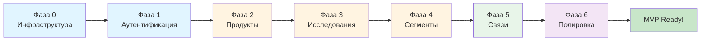

---

## Timeline разработки по фазам

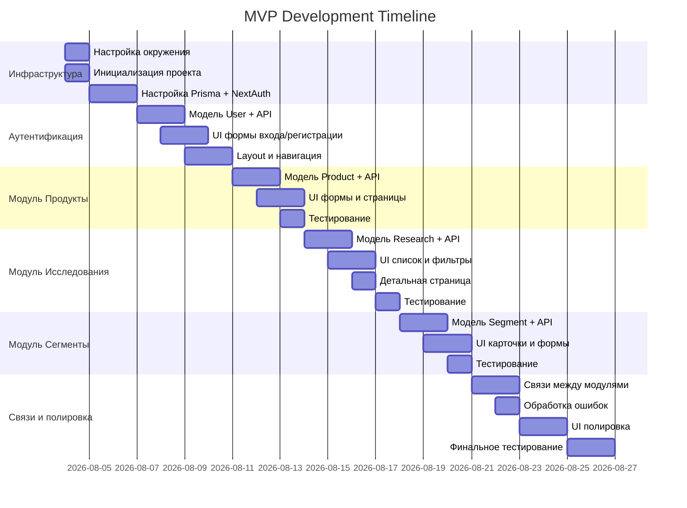

---

## Архитектура системы (по факту реализации)

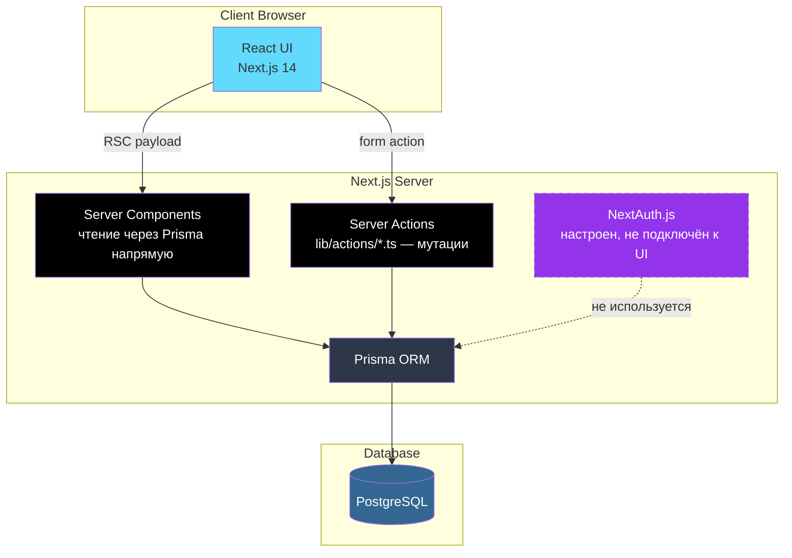

Плановая версия (REST API Routes + React Query) не реализовывалась — Server Actions оказались достаточны и проще для CRUD без клиентского кеша.

---

## Модули P0 и их приоритет

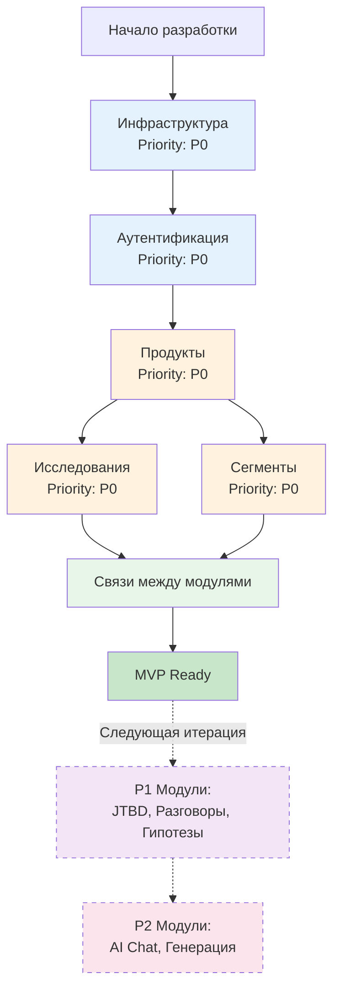

---

## Структура базы данных (ER-диаграмма, по факту реализации)

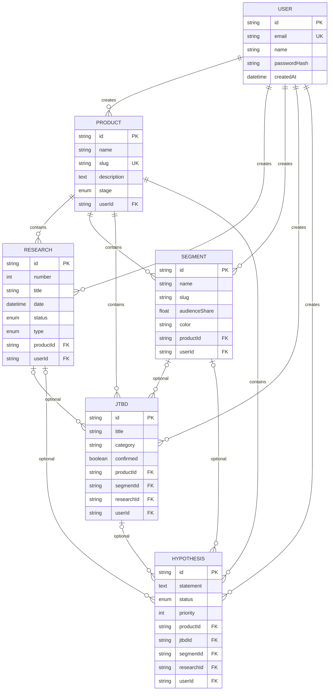

---

## Milestone и критерии успеха

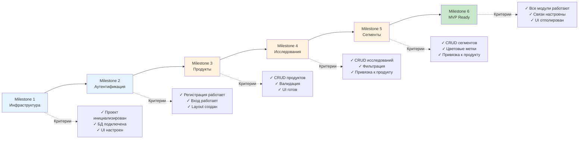

---

## Технологический стек

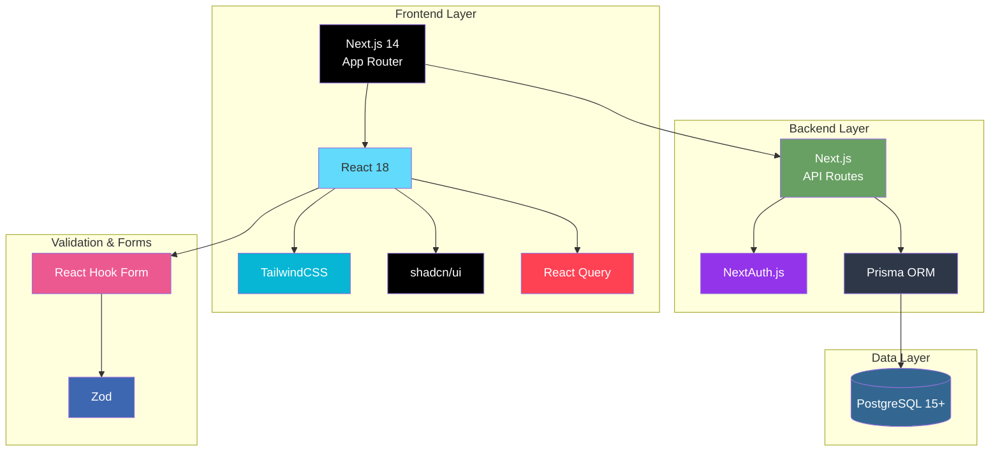

---

## Путь пользователя в MVP

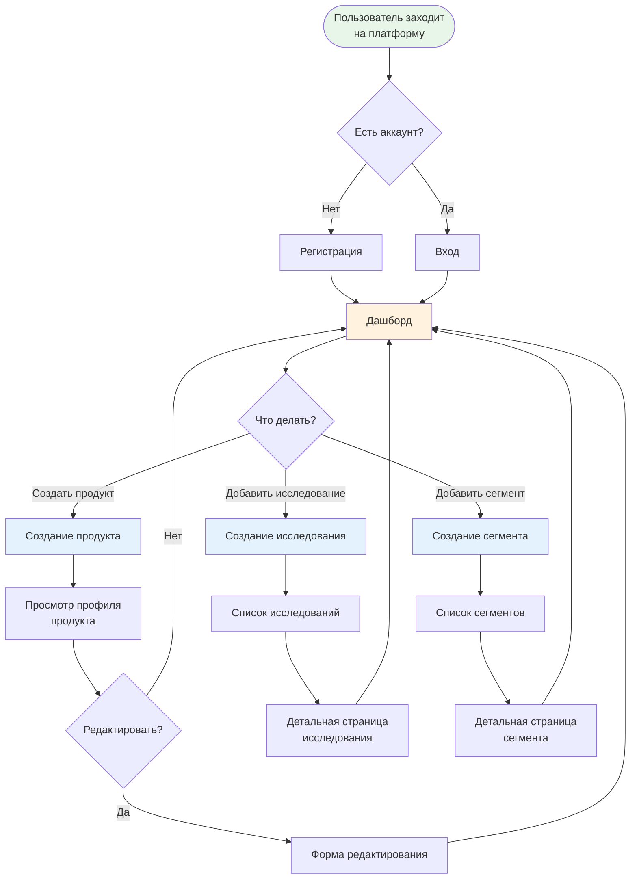

---

## Что реализовано vs что отложено (по факту, не по исходному плану)

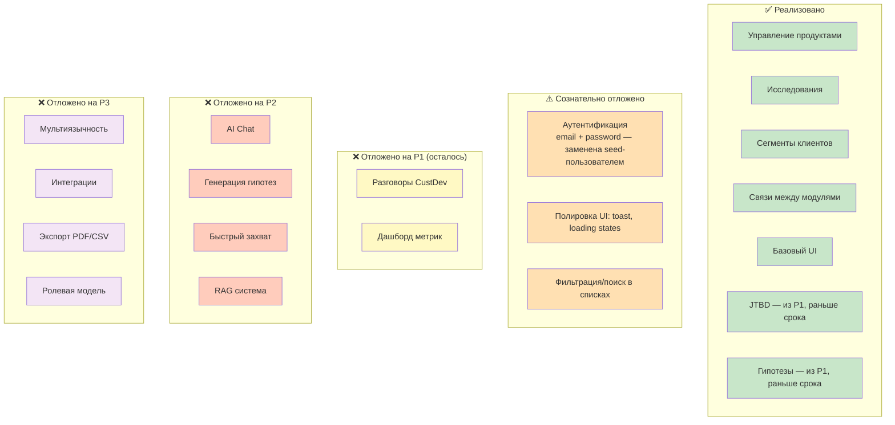

---

## Риски и митигация

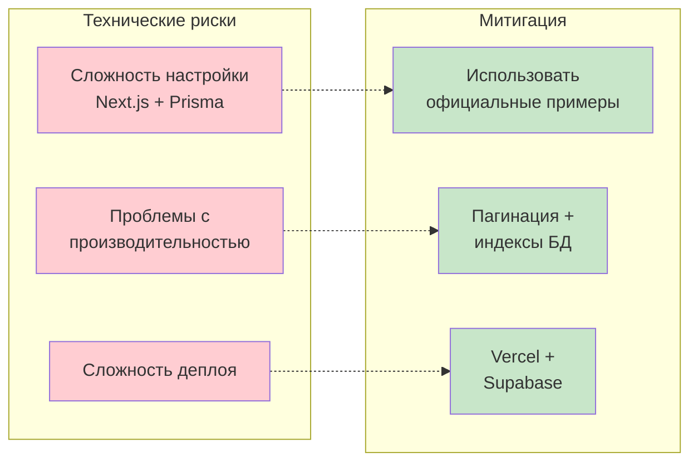

---

## Следующие шаги после MVP

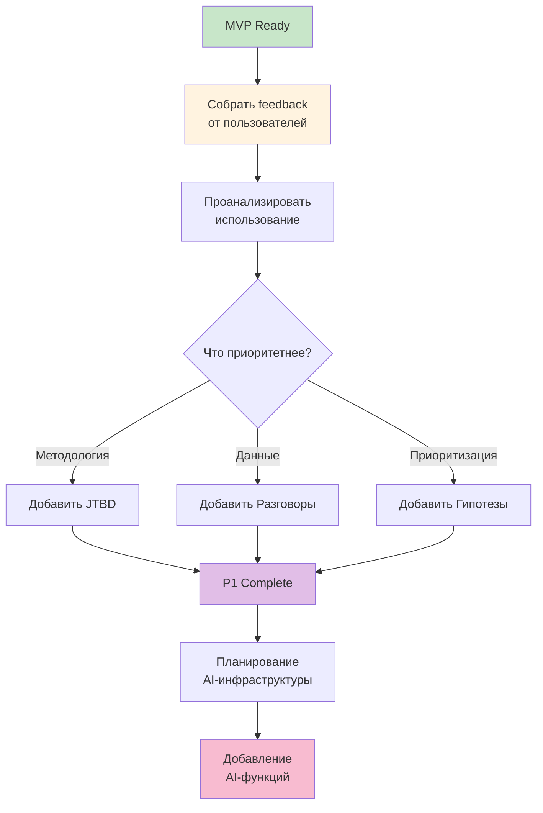

---

## Резюме

**MVP платформы ECHO** - это минимальная, но функциональная версия продукта, которая позволяет:

✅ **Управлять продуктами** - создавать профили продуктов с описанием и стадией  
✅ **Хранить исследования** - вести репозиторий клиентских исследований  
✅ **Сегментировать аудиторию** - создавать и управлять сегментами клиентов  
✅ **Связывать данные** - привязывать исследования и сегменты к продуктам

**Технологии:** Next.js 14, React 18, PostgreSQL, Prisma, NextAuth.js, TailwindCSS, shadcn/ui

**Для кого:** Solo-разработчик, работающий итеративно

**Результат:** Работающая платформа для product discovery с возможностью масштабирования
